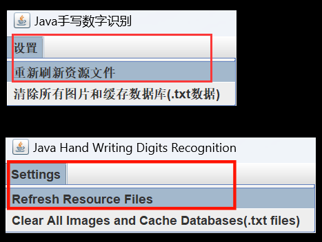
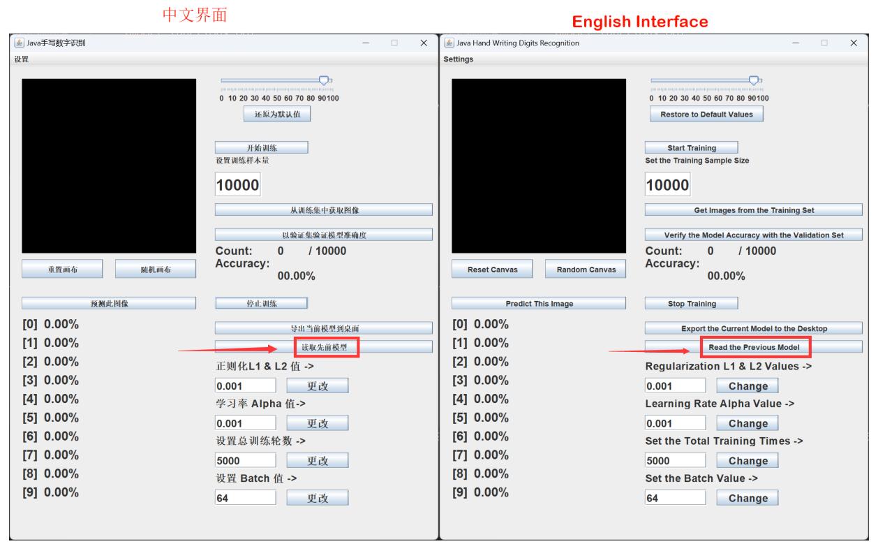
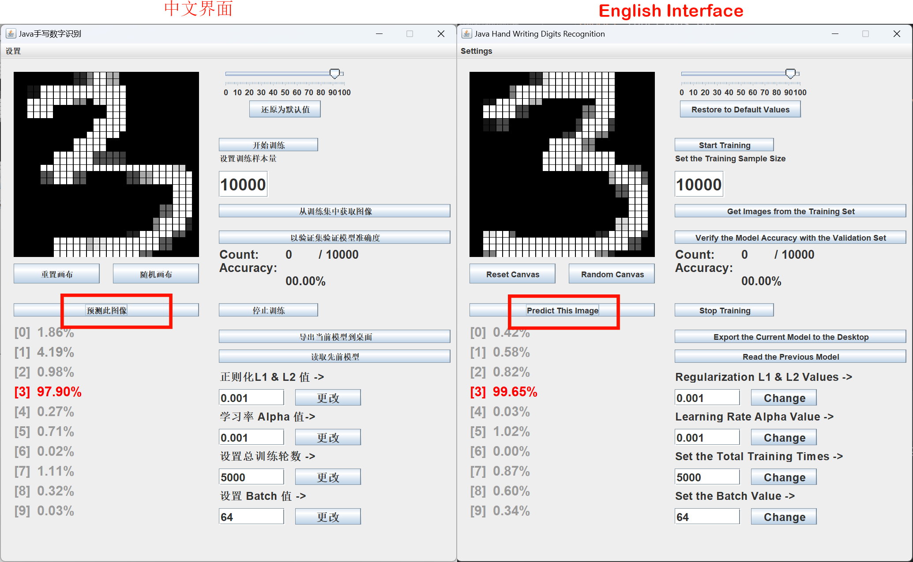
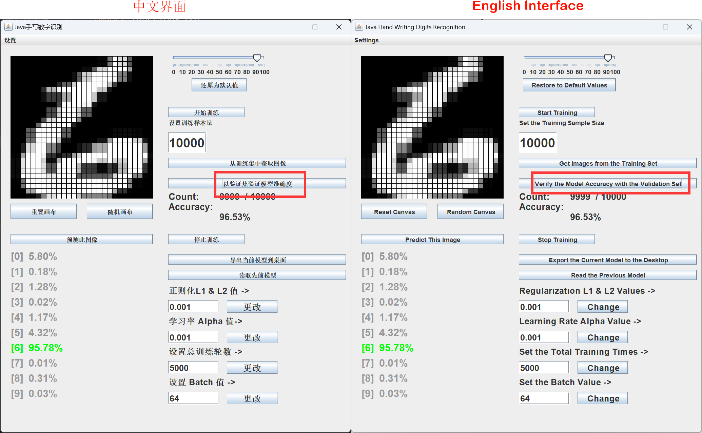

# Java Hand Writing Digit Recognition

> # Java手写数字识别

Read [How to implement a neural network for handwritten digit recognition in Java.pdf]([https://github.com/CH3COOK2023/Java-Hand-Writing-Digit-Recognition-Application/blob/main/How to implement a neural network for handwritten digit recognition in Java.pdf](https://github.com/CH3COOK2023/Java-Hand-Writing-Digit-Recognition-Application/blob/main/How%20to%20implement%20a%20neural%20network%20for%20handwritten%20digit%20recognition%20in%20Java.pdf)) for more information!

> 阅读 [如何在Java中实现手写数字识别神经网络.pdf](https://github.com/CH3COOK2023/Java-Hand-Writing-Digit-Recognition-Application/blob/main/如何在Java中实现手写数字识别神经网络.pdf) 文件以获得更多信息！

## Setup

> ## 初始化

Import it and then run the `Application` class to start the program.

> 导入后运行`Application` 类以启动程序

**STEP 1:**

When starting the program for the first time, please click on `Settings` -> `Refresh Resource Files Again` in the upper left corner.

> 初次启动程序请单击左上角  `设置` -> `重新刷新资源文件`

**STEP 2:**

Then, click on `Read the Previous Model` to obtain the already trained model. (Every single time the program is started, the program will not read any model. Instead, it will randomize the neural network.)  :)

> 然后，点击`读取先前模型`来获取已经训练好的模型（每次启动程序，程序都不会读取任何模型，而是把神经网络做一个随机）:)

**STEP 3:**

Try to write a number and then click on `Predict This Image` button.

> 尝试写一个数字，然后点击`预测此图像`

## Verify Accuracy Of The Current Model

> ## 验证当前模型的准确度

Click `Verify the Model Accuracy with the Validation Set` button.

> 按下`以验证集验证模型准确度`按钮

